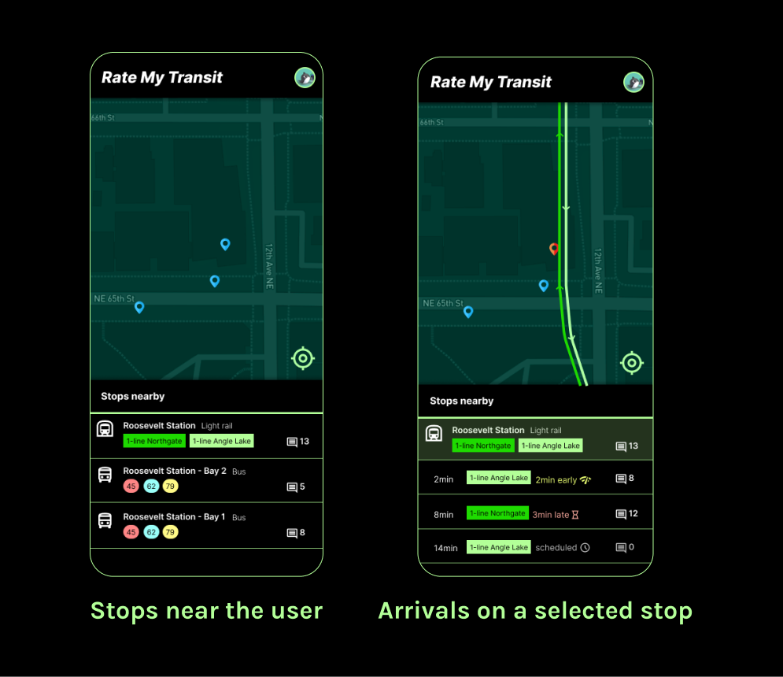
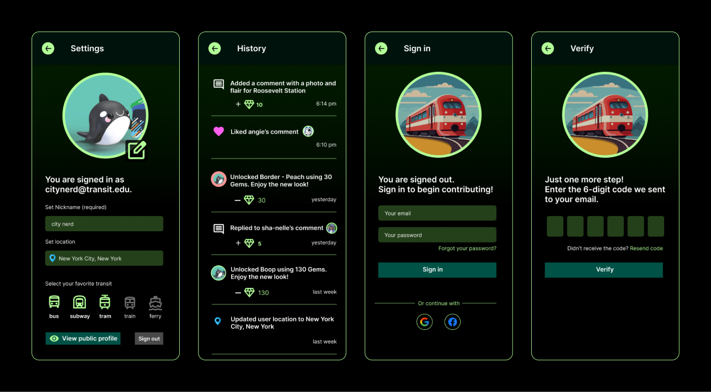
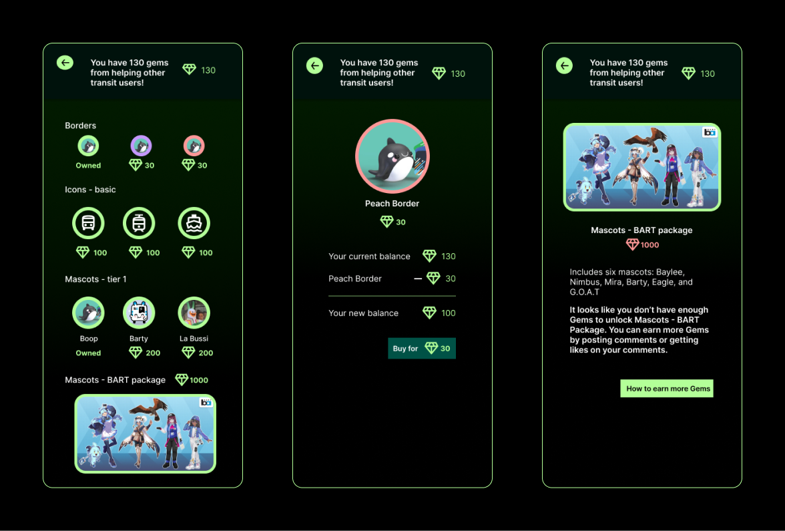

# Rate My Transit

**Date**: January 1, 2024 → February 1, 2024

**My Role**: UX Designer, UI Designer, User Researcher

**Tools**: Figma, Google Forms, Google Maps

<a class="m-1 btn btn-outline-primary btn-md" href="https://www.figma.com/proto/aieuCgf8mMRaZJQ4ZWdVnT/ratemytransit?node-id=212-613&t=pJakPFAuMHCGE4gR-1&scaling=min-zoom&page-id=108%3A231&starting-point-node-id=187%3A56" target="_blank">
See a live demo on Figma
</a>

## Problem Statement: Transit could be a lot more user friendly
Many people experience difficulty with transit apps on their daily commute. Some apps display outdated information, others have too many ads, and many don’t meet accessibility standards. Transit users have turned to online forums like Reddit to get real-time updates on travel conditions. A transit-focused social media app that addresses these problems would help thousands of commuters.


Empathize
Define
Ideate
Design



## Empathize
The inspiration for Rate My Transit was born from the daily struggles of public transit users to obtain timely and accurate information about travel conditions. To start out, I conducted research on existing challenges, user goals, and feedback on how a transit app could fill the niche for the target audience. 

### Where Transit apps come short

Do existing transit apps address the needs of transit users? What problems are not addressed?

✅ - has feature

❌ - does not have feature

➖ - not applicable

|User Need | Google Maps | OneBusAway | Transit App |
|:--|:--:|:--:|:--:|
|Arrival times|✅|✅|✅|
|Conditions on each vehicle|❌|❌|✅|
|Conditions at the station|✅|❌|❌|
|Comments and updates from other users|✅|❌|❌|
|Replies and upvotes|❌|❌|❌|
|Rewards users for engagement|✅|➖|✅|
|Meets accessibility standards|✅|❌|❌|

### Reaching out to Users
In January, I created a survey asking 20 transit users from the Seattle area about the challenges they face while using transit apps. The feedback primarily centered on updated information and travel conditions.

The majority of users in the survey talked about outdated information. This pain point made it harder for them to rely on transit apps to plan their trip.

### User Interviews and Quotes
Transit users provided statements on their goals and frustrations while using public transit apps. Their statements give valuable insights into how Rate My Transit could help most transit users.

Shanelle - Influencer
> ”Taking transit to school is stressful if I don’t know whether the elevators and other accessible options are working. I have to tell my mom ahead of time so she knows whether drive me to school. An app would really help with that.”

Stephan - Sports retailer
> ”When I visit a new city to attend a game or promotional events, it’s hard to navigate the transit system for the first time. I’d love an app that generally covers transit stops anywhere.”

## Define
Using the data I have gathered from talking to real transit users around the community, it's time to define the scope of the problems and propose solutions that Rate My Transit could offer.

### User Personas

Based on information gathered from quantitative research and qualitative research, I crafted user personas to represent the main two categories of transit users: visitors and locals.

**Persona 1** - The traveler

| - | - |
|---|---|
|  | Name - City Nerd Age - 52 Pronouns - he/him Location - Visiting Seattle from NYC|

_Retired professor and urban planner. City Nerd runs a popular YouTube Channel about urban design._

Goals

- City Nerd is visiting Seattle and wants to have a good time riding the various transit options and visiting local businesses
- He does not live in Seattle anymore and the city has changed a lot. He will have to buy tickets as a tourist and learn the metro lines.

Frustrations

- He arrived at the airport and found both ticket machines broken. He did not know where to buy his transit pass
- While visiting downtown on a busy weekday, he tried to catch a Link train that was cancelled without warning. The Sound Transit alerts were too delayed to notify him until he was already on the platform.

**Persona 2** - The local

| - | - |
|---|---|
|  | Name - Angie T. Age - 22 Pronouns - they/them Location - Capitol Hill (Seattle neighborhood)|

_Freelance artist working at a gallery in Capitol Hill. Angie uses a wheelchair and is an advocate for urban accessibility and disability rights._

Goals

- Angie travels to the Fremont Sunday Market every week to sell their artwork. They want this long trip to be as accessible as possible.

Frustrations

- They arrived at Capitol Hill station and took the first elevator from the platform to the mezzanine, only to find that the second elevator to the street level was out of service. As a result, they had to take the same elevator back down to the platform and use a separate elevator on the other side of the station. Angie wishes they could see information about elevator closures ahead of time.

### Findings

Based on feedback from users, I identified the main problems with existing transit apps and the ways Rate My Transit will address those problems.

| Problems | Solutions |
|---|---|
|Transit information is outdated or inaccurate|Keep updates current, with the focus on real-time updates from the past 24 hours so users are not misled by posts from many years ago|
|Riders want to know about conditions at stations too, not just on vehicles. Knowing what is working and what is broken ahead of time would help users plan alternate travel|Show, don’t tell. Rate My Transit communication will be driven by photos and comments, with a general mentions section composed of tags showing key words that other riders are talking about|

## Ideate
I brainstormed a set of features that would provide the solutions to the problems users experience in existing transit apps. 

**Arrivals**

A major request among users was to improve the reliability of arrival information.

**Comments and Social Media**

Users reported having to turn to reddit, twitter, and other social media apps to get updates that transit apps could not convey, such as a description of conditions at a station or on board a train. Providing a discussion space for comments would save users the trouble of having to switch apps.

**Profile and Notifications**

Users who leave comments or ask questions would like updates, notifications, and other informative feedback as they navigate the app. The profile feature would allow them to manage settings and preferences, view their history, and authenticate with their email credentials for a secure user experience.

Bonus Feature: **Rewards**

Some users also raised the concern that existing apps don't provide enough incentives and rewards for users to post updates and reviews. Users put in time and effort to help others, and the app should reciprocate that by engaging users with rewards, gamification, and bonuses so they feel valued for their time.

## Design

After I interviewed users, defined problem scope and solutions, and narrowed down the set of features, I put together the wireframes, the style guide, and the high-fidelity designs.

### Design System

The design system includes elements like color, icons, typography, and components. The visual clarity of the badges and components gives users a quality experience as they are looking for updated transit information, station and vehicle conditions, and travel recommendations around the city. The visual clarity of the elements upholds accessibility guidelines and makes the app enjoyable to use.

### High Fidelity Prototype

This is the final iteration of what the product would look like, with all of the styles and colors from the design system applied.

<a class="m-1 btn btn-outline-primary btn-block" href="https://www.figma.com/proto/aieuCgf8mMRaZJQ4ZWdVnT/ratemytransit?node-id=212-613&t=pJakPFAuMHCGE4gR-1&scaling=min-zoom&page-id=108%3A231&starting-point-node-id=187%3A56" target="_blank">
See a live demo on Figma
</a>

## Conclusions and Next Steps

Building Rate My Transit has been one of my favorite projects. Transit accessibility and expansion is an area I feel passionate about and I think apps can do a lot to enhance the transit experience for riders everywhere.

Here are some of my key takeaways:
* Users love summaries and concise information that's easily digestable. A key principle in user psychology is that everyone wants to conserve effort whenever possible. I found that having the auto-generated tags at the top of each station and vehicle did wonders for user satisfaction because it saved them the effort of having to scroll through all of the comments and do a lot of reading.

* Outside of the core features that address the major challenges faced by users I interviewed, the auxilary features like the profile, mascots, and rewards can truly delight users and bring personality to the app. I drew inspiration from existing transit system mascots like Boop the Orca (Sound Transit) and Barty the train (BART) which add a cuteness factor to public transit systems.

Next Steps
* Integration with external social media apps like Reddit, Twitter, and mainstream news sites would help get even more timely, updated tags for travel conditions. This would enable AI summaries and crossposting for RMT users.
* Rewarding users with tangible benefits would be a great incentive for more users to join the community. This could mean discounts on transit passes, coupons for transit merchandise, and perks for local businesses that sponsor transit. Such a feature would mean having my app enter partnerships with transit systems and businesses.
* A groups and chat feature would help riders coordinate with travel buddies and others who frequently use the same lines. 