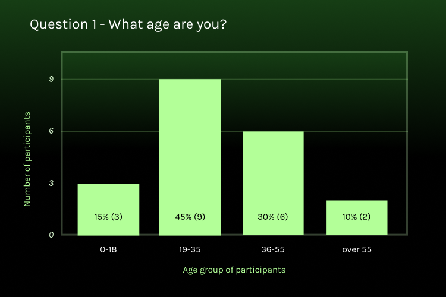

# Rate My Transit

Welcome to Rate My Transit, a mobile transit app designed to make your commute easier and more predictable. Rate My Transit gives users real-time updates on travel conditions from the local transit community. Unlike other transit apps, Rate My Transit prioritizes the user experience by avoiding ads and maintaining high accessibility standards. The vibrant community of transit users can share information over Rate My Transit to help other riders navigate travel conditions at stations and on transit vehicles.

**Date**: January 1, 2024 → February 1, 2024

**My Role**: UX Designer, UI Designer, User Researcher

**Tools**: Figma, Google Forms, Google Maps




Transit could be a lot more user friendly
User-Centric Design Process
Competitive Analysis
Quantitative research
Qualitative research
User Personas
Problem Statement
Bringing Rate My Transit to life
Design System
Feature Overview
High Fidelity Prototype



## Transit could be a lot more user friendly
Many people experience difficulty with transit apps on their daily commute. Some apps display outdated information, others have too many ads, and many don’t meet accessibility standards. Transit users have turned to online forums like Reddit to get real-time updates on travel conditions. A transit-focused social media app that addresses these problems would help thousands of commuters.

## User-Centric Design Process

1- Empathize

- Competitive Analysis: Comparing Rate My Transit to other transit apps
- Qualitative Research: Collecting the numbers from user surveys on factors like age group, app preferences and pain points
- Quantitative Research: Asking for written feedback and stories from real users in the target audience

2- Define

- Defining two user personas based on the data collected to represent the main demographics of potential users and their preferences
- Problem Statements: Identifying what problems users face
- Proposing solutions that Rate My Transit could offer for these problems

3- Ideate

- Brainstorming which features to include
- Information Architecture: Building the sitemap and user flow of the app

4- Design

- Wireframes: Simple mockups to show the key features and layouts of the app
- Design System: Typography, color, and components used in the app
- High Fidelity Prototype: A polished design of the app and a prototype of how the app would be used

## Competitive Analysis

How does Rate My Transit compare with other transit apps?

✅ - has feature

❌ - does not have feature

➖ - not applicable

|Features | Google Maps | OneBusAway | Transit | RMT|
|:--|:--:|:--:|:--:|:--:|
|Arrival times|✅|✅|✅|✅|
|Conditions on each vehicle|❌|❌|✅|✅|
|Conditions at the station|✅|❌|❌|✅|
|Users can type comments|✅|❌|❌|✅|
|Replies and upvotes|❌|❌|❌|✅|
|Ad-free|❌|✅|❌|✅|
|Rewards users for engagement|✅|➖|✅|✅|
|Meets accessibility standards|✅|❌|❌|✅|

### Quantitative research

Quantitative research helps to gather information about the kinds of users who would benefit the most from a new transit app. Who are the users and what are their primary concerns with existing transit apps?

The largest group of transit users were in the 19-35 age group. The second largest group was aged 36-55. The smallest groups were below 18 and over 55. 

Transit users in the survey mostly used Google Maps, Transit app, and OneBusAway to plan their travel.

The majority of users in the survey talked about outdated information. This pain point made it harder for them to rely on transit apps to plan their trip.

### Qualitative Research

Transit users provided statements on their goals and frustrations while using public transit apps. Their statements give valuable insights into how Rate My Transit could help most transit users.

Parissa - Radiology clinic technician
> ”I really like it when the apps give me suggestions based on my previous activity. That saves me time from having to look everything up again.”

Shanelle - Influencer
> ”Traveling to school is stressful if I don’t know whether the elevators and other accessible options are working. I have to tell my mom ahead of time so she knows whether drive me to school. An app would really help with that.”

Heli - Chemist
> ”As an older transit user, technology isn’t my forte. I get confused often by the official communications on Sound Transit which are sent over SMS. I would like an app that is easy and accessible for me.”

Andrei - Kitchen staff
> ”I use apps to decide whether to drive to work or take the bus. If the information is inaccurate, I might end up late to work which is frustrating.”

Stephan - Sports retailer
> ”When I visit a new city to attend a game or promotional events, it’s hard to navigate the transit system for the first time. I’d love an app that generally covers transit stops anywhere.”

Raymond - Valves engineer
> "Posting reviews and photos on Google Maps is such a thankless task. The rewards we get feel far inferior to the amount of time we put in. My ideal transit app would engage users and reward them for contributing. That would encourage them to contribute more.”

### User Personas

Based on information gathered from quantitative research and qualitative research, we crafted user personas to represent the main users for our app.

**Persona 1**

| - | - |
|---|---|
|  | Name - City Nerd Age - 52 Pronouns - he/him Location - Visiting Seattle from NYC|

_Retired professor and urban planner. City Nerd runs a popular YouTube Channel about urban design._

Goals

- City Nerd is visiting Seattle and wants to have a good time riding the various transit options and trying tasty food
- He does not live in Seattle anymore and the city has changed a lot. He will have to buy tickets as a tourist and learn the metro lines.

Frustrations

- He arrived at the airport and found both ticket machines broken. He did not know where to buy his transit pass
- While visiting downtown on a busy weekday, he tried to catch a Link train that was cancelled without warning. The Sound Transit alerts were too delayed to notify him until he was already on the platform.

**Persona 2**

| - | - |
|---|---|
|  | Name - Angie T. Age - 22 Pronouns - they/them Location - Capitol Hill (Seattle neighborhood)|

_Freelance artist working at a gallery in Capitol Hill. Angie is also an advocate at several disability rights groups._

Goals

- Angie travels to the Fremont Sunday Market every week to sell their artwork. They want this long trip to be as accessible as possible.
- They want the city to be more accessible place for people with disabilities and everyone else.

Frustrations

- They arrived at Capitol Hill station and took the first elevator from the platform to the mezzanine, only to find that the second elevator to the street level was out of service. As a result, they had to take the same elevator back down to the platform and use a separate elevator on the other side of the station. Angie wishes they could see information about elevator closures ahead of time.

## Problem Statement

Based on our user research, we’ve identified the main problems with existing transit apps and the ways Rate My Transit will address those problems.

Problems

- Technical problems include lag, crashes, and bugs that make the user experience a nightmare for transit riders in a hurry
- Too many ads
- Transit information is outdated or inaccurate
- Riders want to know about conditions at stations too, not just on vehicles. Knowing what is working and what is broken ahead of time would help users plan alternate travel
- Users are not rewarded for helping each other, which means there is no incentive to keep posting updates

Solutions

- Resolve technical problems by building a lightweight, smooth app with no ads
- Keep updates current, with the focus on real-time updates from the past 24 hours so users are not misled by posts from many years ago
- Show, don’t tell. Rate My Transit communication will be driven by photos and comments, with a general mentions section composed of tags showing key words that other riders are talking about
- Reward users for engagement by awarding in-app currencies that can be generated through activity such as posting and replying. Users can spend these rewards in the app or on coupons.

## Bringing Rate My Transit to life

After conducting user research and building a list of solutions that Rate My Transit would offer, it’s now time to build the app designs. Wireframes show us what the early iterations of the features looked like.

## Design System

The design system includes elements like color, icons, typography, and components.

## Feature Overview

../rmt_assets/feature_arrivals.png
../rmt_assets/feature_comments.png
../rmt_assets/feature_profile.png
../rmt_assets/feature_rewards.png



## High Fidelity Prototype

This is the final iteration of what the product would look like, with all of the styles and colors from the design system applied.

