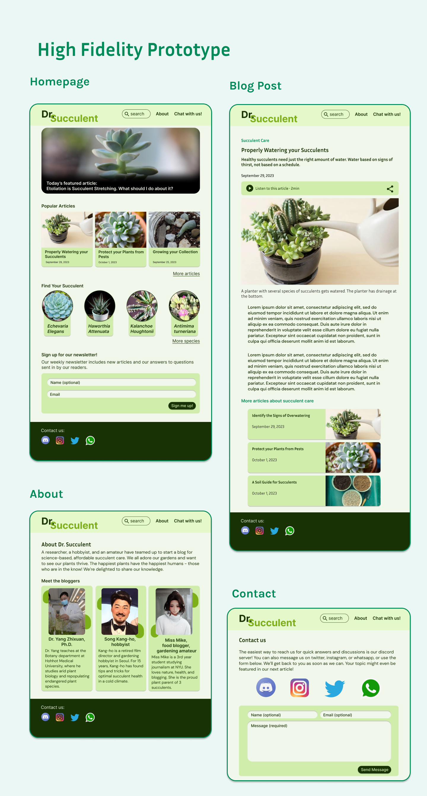

# Dr. Succulent

Dr. Succulent is a succulent care blog run by three gardening enjoyers to help gardeners around the world with their green collections. They want the site to be free, accessible, and formatted like a news blog that has an area for readers to contact them with questions about succulent health.

**Date**: December 12, 2023 → January 1, 2024

**My Role**: UX Designer, UI Designer, User Researcher

**Tools**: Figma, Google Forms, Notion

<a class="m-1 btn btn-outline-primary btn-md" href="https://www.figma.com/proto/TrOFdC9J0Hr8uiLmAi1iB4/Dr.-succulent?node-id=279-200&t=pHXzgVzQMhhCPRh5-1&scaling=scale-down&page-id=0%3A1&starting-point-node-id=279%3A200" target="_blank">
See a live demo on Figma
</a>


A Special Blog for Plant Enthusiasts
User-Centric Design Process
Quantitative research
Qualitative research
User Personas
Problem Statement
Wireframes
Design System
Feature Overview
High Fidelity Prototype



## A Special Blog for Plant Enthusiasts

Dr. Succulent is a plant care blog run by a researcher, a hobbyist, and an amateur to help gardeners around the world with their green collections. Their blog will present scientifically verified information that is free, accessible, and formatted like a news blog. The authors will interact with their community of readers by providing social media channels and an area for readers to contact them with questions.

## User-Centric Design Process

1- Empathize

- Qualitative Research: Collecting the numbers from user surveys on factors like age group, app preferences and pain points
- Quantitative Research: Asking for written feedback from real users in the target audience

2- Define

- Defining two user personas based on the data collected to represent the main demographics of potential users and their preferences
- Problem Statements: Identifying what problems users face
- Proposing solutions that Dr. Succulent could offer for these problems

3- Ideate

- Brainstorming which features to include
- Information Architecture: Building the sitemap and user flow of the app

4- Design

- Wireframes: Simple mockups to show the key features and layouts of the app
- Design System: Typography, color, and components used in the app
- High Fidelity Prototype: A polished design of the app and a prototype of how the app would be used

### Quantitative research

Quantitative research helps to gather information about the kinds of users who would benefit the most from Dr. Succulent. Who are the users and what are their primary concerns with existing plant blogs? What can Dr. Succulent provide for them?

Our survey results show that the majority of people who visit gardening blogs consider themselves hobbyists who have kept houseplants for a few years. They spend a couple hours each week seeking reliable gardening knowledge online. They primarily want to reduce the number of ads, fix technical problems with sites, improve accessibility, and trust that what they’ve read is scientifically accurate information.

### Qualitative Research

Gardeners provided statements on their goals and frustrations while using online gardening resources. Their statements give valuable insights into how Dr. Succulent could improve the experience for gardening hobbyists seeking information online.

Camilla Rojas - Radiology clinic technician
> “I wish there would be an audio feature for gardeners who are visually impaired.”

Shanelle Johnson - Tiktok Influencer
> “If only my favorite gardening site didn’t crash half the time from all those ads.”

Nguyen Hoang - Sports Physician
> “I’m a busy guy and I really don’t have time for pseudoscientific nonsense.”

Vanya Pathuri - Kitchen staff
> “My ideal gardening blog would have plenty of sources for further reading.”

Mahmoud Syed - Retired pilot
> “I’d like to talk to experts about a specific issue my favorite plant is having. Some blogs are too general.”

Sophia Lim - Valves engineer
> “It’s hard to trust gardening sites that are clearly trying to sell me something. Do they really recommend that product or are they doing it for the sponsorship?”

### User Personas

Based on information gathered from quantitative research and qualitative research, we crafted user personas to represent the main users for Dr. Succulent.

**Persona 1**

| - | - |
|---|---|
|  | Name - Camilla Rojas Age - 34 Pronouns - she/her Location - Denver, Colorado, USA|

_Technician at a local radiology clinic and succulent hobbyist. Mother of 2._

Goals

- Wants to raise a garden of healthy succulents that grow outside, but is concerned that she is doing it wrong
- She loves collecting more species of plants to diversify her garden and she wants to find good resources on how to properly care for each new species.

Frustrations

- She is visually impaired and wants a blog that can read the articles to her like an audiobook.
- She has a specific problem with one of her plants that she has not found good resources for. She hopes to talk directly to an expert because she has spent some time researching this issue without success.

**Persona 2**

| - | - |
|---|---|
|  | Name - Nguyen Hoang Age - 29 Pronouns - he/him Location - Hanoi, Vietnam|

_Busy sports physician for the local soccer club and youth team. He does not have a lot of time to research for gardening info._

Goals

- Hoang wants to raise healthy, beautiful succulents for his home and balcony. He wants to ask specific questions about the climate of his city, Hanoi, and whether it would be a bad idea to raise certain species of plants.
- His friend Vin recently moved out of town and Hoang agreed to look after his plants. Vin checks on his plants every couple weeks and Hoang sends him photos on social media.

Frustrations

- Hoang didn't anticipate having this many plants. He is also concerned that the climate in his city is unsuited for succulents, which he bought a few of before he knew Vin would be moving out.
- Hoang found online blogs but the information they presented was too general. Other blogs offered pseudoscientific information that was easy for Hoang, a physician, to debunk.

## Problem Statement

Based on our user research, we’ve identified the main problems with other gardening blogs and the ways Dr. Succulent will improve the user experience.

Problems

- Unrealiable and pseudoscientific information makes fact-finding a nightmare for new gardeners
- Too many ads
- Lack of accessibility on many blogs makes them difficult for disabled users to navigate
- Users want more information but can’t find the sources or citations

Solutions

- Cite scientific sources and biologists, and provide further reading
- Build a lightweight, smooth app with no ads
- Include an audio option for articles and make the UI compliant with accessibility. Colors will be WCAG compliant
- Give users links to social media so they can ask questions directly to the gardening experts

## Wireframes

After conducting user research and building a list of ways Dr. Succulent would improve the experience for gardeners seeking information, it’s now time to build designs for the site. Wireframes show us what the early concepts for the pages looked like.

## Design System

The design system includes elements like color, icons, typography, and components.

## Feature Overview

## High Fidelity Prototype

<a class="m-1 btn btn-outline-primary btn-block" href="https://www.figma.com/proto/TrOFdC9J0Hr8uiLmAi1iB4/Dr.-succulent?node-id=279-200&t=pHXzgVzQMhhCPRh5-1&scaling=scale-down&page-id=0%3A1&starting-point-node-id=279%3A200" target="_blank">
See a live demo on Figma
</a>