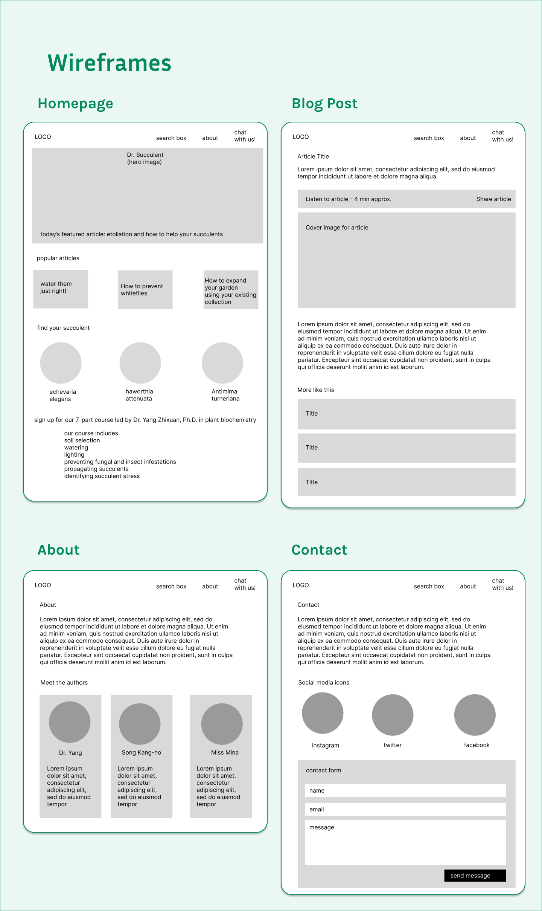
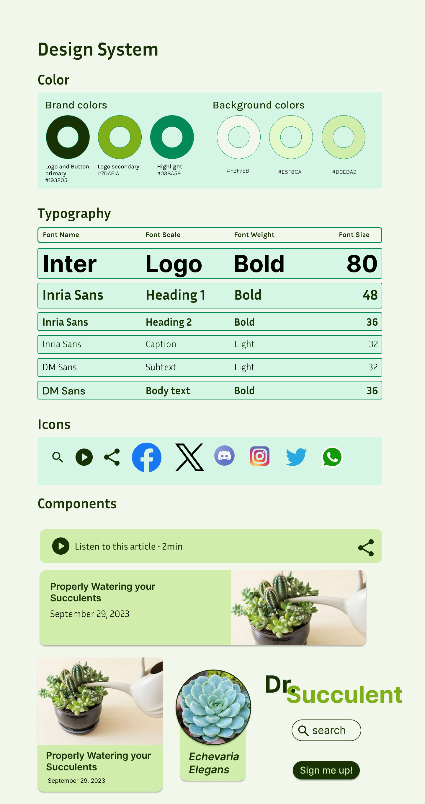
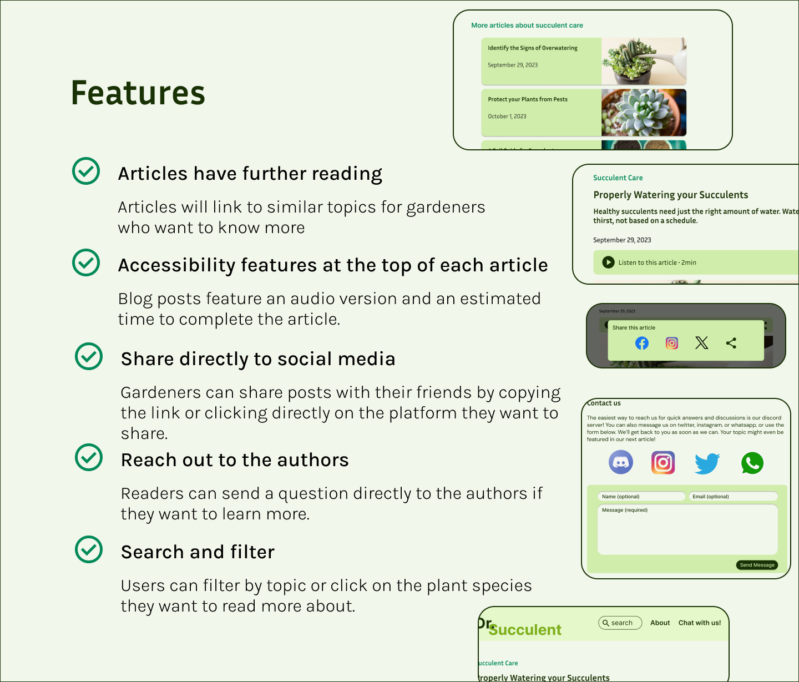
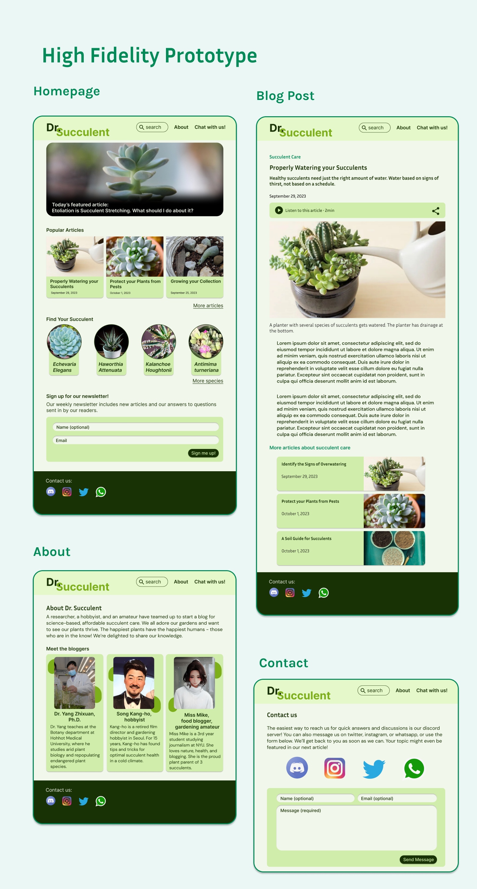

# League of Skins

League of Skins is a mobile gaming companion designed to help League of Legends players track their performance on their champions while using skins. Many players want to know if they do better using one skin compared to another, and League of Skins will help them make the best decision to suit their gaming needs.

**Date**: November 15, 2023 → December 10, 2023

**My Role**: UX Designer, UI Designer, User Researcher

**Tools**: Figma, Google Forms, Notion

<a class="m-1 btn btn-outline-primary btn-md" href="https://www.figma.com/proto/TrOFdC9J0Hr8uiLmAi1iB4/Dr.-succulent?node-id=279-200&t=pHXzgVzQMhhCPRh5-1&scaling=scale-down&page-id=0%3A1&starting-point-node-id=279%3A200" target="_blank">
See a live demo on Figma
</a>


User-Centric Design Process
Quantitative research
Qualitative research
User Personas
Problem Statement
Wireframes
Design System
Feature Overview
High Fidelity Prototype



## User-Centric Design Process
My user research consisted of interviewing users, observing their gameplay and my own, and building user journey maps

The primary users of the app indicated that my mockups fit their needs. They also suggested that I add more items to the stats and change the stats section to a tabbed layout rather than expandable sections. Several users also expressed that the original mockups were too cluttered and could be made more accessible by reducing the amount of text on each screen.

1- Empathize

- Qualitative Research: Collecting the numbers from user surveys on factors like age group, app preferences and pain points
- Quantitative Research: Asking for written feedback from real users in the target audience

2- Define

- Defining two user personas based on the data collected to represent the main demographics of potential users and their preferences
- Problem Statements: Identifying what problems users face
- Proposing solutions that League of Skins could offer for these problems

3- Ideate

- Brainstorming which features to include
- Information Architecture: Building the sitemap and user flow of the app

4- Design

- Wireframes: Simple mockups to show the key features and layouts of the app
- Design System: Typography, color, and components used in the app
- High Fidelity Prototype: A polished design of the app and a prototype of how the app would be used

### User Pain Points

Quantitative research helps to gather information about the kinds of players who would benefit the most from League of Skins. What are their primary concerns while using cosmetics in League of Legends? How can League of Skins improve the experience for these players?

- **Buyer's Remorse**  
The player spends money on a new skin but is struggling to perform well while using it. They don't know if the purchase was worth it, and if they should keep buying skins for their favorite champion if they will simply play worse.

- **In-Game Decisions**  
The player cannot decide which skin to use. Time is limited and they struggle to finish other settings like their runes and summoner spells if they are distracted by which skin to use.

- **Tedious Stats Tracking**  
The player creates a spreadsheet to track their performance on different skins. They hope this spreadsheet will show them which skin they play the best with. However, updating this spreadsheet is time-consuming and difficult.

- **Pay to Lose**  
The player's friends and teammates say the new skin they bought makes it harder to see their character in-game. The friends would rather this player use a different skin or the default champion model.

### Qualitative Research

League of Legends players provided statements on their goals and frustrations while using or purchasing cosmetics in game. How could League of Skins improve the experience for players trying to enjoy the game with their newly bought skins?

2102044 - Renekton and Aatrox main
> “My support duo says it's harder to play with me if I use Project Renekton. They would rather I use Renektoy.”

Reilly the Ghost - ARAM only player
> “I play a huge champion pool and I want to make sure I pick the right skin before I load into my next ARAM game.”

thors_hammer - Diamond jungle smurf, permabanned
> “I keep creating new accounts because I'm permabanned on my main account. I just want to know which skins to buy as gifts for my friends because all of my current accounts don't matter to me.”

da golden toilet - Mid mages main
> “I have spent over $5000 on this game and I'm not stopping until I buy every skin there is. Now, which ones will I actually use in game?”

zhixuan - Offmeta support main
> “I play weird things like Twitch, Anivia, and Camille support. I need extra time to look up the runes and settings for these champs, and the limited time in champ select makes it hard to complete these settings if I'm also trying to pick a skin.”

TL Honda Pentalove - Aspiring pro ADC player
> “I've been painstakingly tracking my stats across all of the skins I own to determine which ones I should use in pro play. My sponsorships depend on it!”

### User Personas

Based on information gathered from quantitative research and qualitative research, we crafted user personas to represent the main users for Dr. Succulent.

**Persona 1**

| - | - |
|---|---|
|  | Name - Camilla Rojas Age - 34 Pronouns - she/her Location - Denver, Colorado, USA|

_Technician at a local radiology clinic and succulent hobbyist. Mother of 2._

Goals

- Wants to raise a garden of healthy succulents that grow outside, but is concerned that she is doing it wrong
- She loves collecting more species of plants to diversify her garden and she wants to find good resources on how to properly care for each new species.

Frustrations

- She is visually impaired and wants a blog that can read the articles to her like an audiobook.
- She has a specific problem with one of her plants that she has not found good resources for. She hopes to talk directly to an expert because she has spent some time researching this issue without success.

### User Personas

Based on information gathered from quantitative research and qualitative research, we crafted user personas to represent the main users for our app.

**Persona 1**

| - | - |
|---|---|
|  | Name - Nguyen Hoang Age - 29 Pronouns - he/him Location - Hanoi, Vietnam|

_Busy sports physician for the local soccer club and youth team. He does not have a lot of time to research for gardening info._

Goals

- Hoang wants to raise healthy, beautiful succulents for his home and balcony. He wants to ask specific questions about the climate of his city, Hanoi, and whether it would be a bad idea to raise certain species of plants.
- His friend Vin recently moved out of town and Hoang agreed to look after his plants. Vin checks on his plants every couple weeks and Hoang sends him photos on social media.

Frustrations

- Hoang didn't anticipate having this many plants. He is also concerned that the climate in his city is unsuited for succulents, which he bought a few of before he knew Vin would be moving out.
- Hoang found online blogs but the information they presented was too general. Other blogs offered pseudoscientific information that was easy for Hoang, a physician, to debunk.

## Problem Statement

Based on our user research, we’ve identified the main problems with other gardening blogs and the ways Dr. Succulent will improve the user experience.

Problems

- Unrealiable and pseudoscientific information makes fact-finding a nightmare for new gardeners
- Too many ads
- Lack of accessibility on many blogs makes them difficult for disabled users to navigate
- Users want more information but can’t find the sources or citations

Solutions

- Cite scientific sources and biologists, and provide further reading
- Build a lightweight, smooth app with no ads
- Include an audio option for articles and make the UI compliant with accessibility. Colors will be WCAG compliant
- Give users links to social media so they can ask questions directly to the gardening experts

## Wireframes

After conducting user research and building a list of ways Dr. Succulent would improve the experience for gardeners seeking information, it’s now time to build designs for the site. Wireframes show us what the early concepts for the pages looked like.

## Design System

The design system includes elements like color, icons, typography, and components.

## Feature Overview

## High Fidelity Prototype

<a class="m-1 btn btn-outline-primary btn-block" href="https://www.figma.com/proto/TrOFdC9J0Hr8uiLmAi1iB4/Dr.-succulent?node-id=279-200&t=pHXzgVzQMhhCPRh5-1&scaling=scale-down&page-id=0%3A1&starting-point-node-id=279%3A200" target="_blank">
See a live demo on Figma
</a>