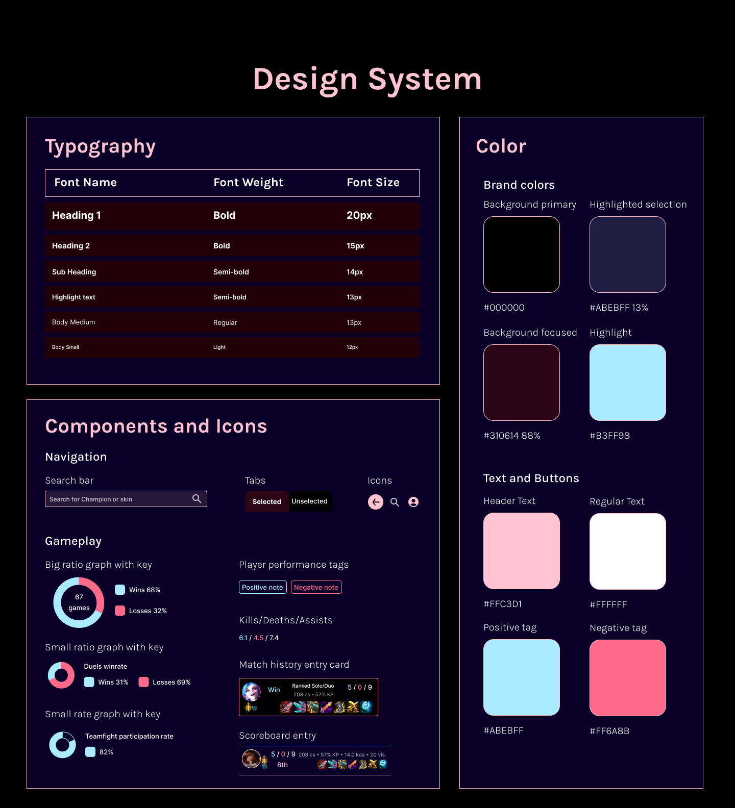

# League of Skins

League of Skins is a mobile gaming companion designed to help League of Legends players track their performance on their champions while using skins. Many players want to know if they do better using one skin compared to another, and League of Skins will help them make the best decision to suit their gaming needs.

**Date**: November 15, 2023 → December 10, 2023

**My Role**: UX Designer, UI Designer, User Researcher

**Tools**: Figma, Google Forms, Notion

<a class="m-1 btn btn-outline-primary btn-md" href="https://www.figma.com/proto/WBxV07OpRVGRyuRdYKuPtS/coursera-project-apps?node-id=224-124&t=AGkKBbd0bsn5U0XL-1&scaling=min-zoom&content-scaling=fixed&page-id=224%3A121" target="_blank">
See a live demo on Figma
</a>


User-Centric Design Process
Qualitative research
User Personas
User Pain Points
Problem Statement
Building League of Skins
Design System
High Fidelity Prototype



## User-Centric Design Process
My user research consisted of interviewing users, observing their gameplay and my own, and building user journey maps

The primary users of the app indicated that my mockups fit their needs. They also suggested that I add more items to the stats and change the stats section to a tabbed layout rather than expandable sections. Several users also expressed that the original mockups were too cluttered and could be made more accessible by reducing the amount of text on each screen.

1- Empathize

- Qualitative Research: Collecting the numbers from user surveys on factors like age group, app preferences and pain points
- Quantitative Research: Asking for written feedback from real users in the target audience

2- Define

- Defining two user personas based on the data collected to represent the main demographics of potential users and their preferences
- Problem Statements: Identifying what problems users face
- Proposing solutions that League of Skins could offer for these problems

3- Ideate

- Brainstorming which features to include
- Information Architecture: Building the sitemap and user flow of the app

4- Design

- Wireframes: Simple mockups to show the key features and layouts of the app
- Design System: Typography, color, and components used in the app
- High Fidelity Prototype: A polished design of the app and a prototype of how the app would be used

### Qualitative Research

League of Legends players provided statements on their goals and frustrations while using or purchasing cosmetics in game. How could League of Skins improve the experience for players trying to enjoy the game with their newly bought skins?

2102044 - Renekton and Aatrox main
> “My support duo says it's harder to play with me if I use Project Renekton. They would rather I use Renektoy.”

Reilly the Ghost - ARAM only player
> “I play a huge champion pool and I never know when I will play the same champion again. I want to make sure I pick the right skin before I load into my next ARAM game.”

thors_hammer - Diamond jungle smurf, permabanned
> “I keep creating new accounts because I'm permabanned on my main account. I just want to know which skins to buy as gifts for my friends because all of my current accounts don't matter to me.”

mumu in a lambo - Mid mages main
> “I have spent over $5000 on this game and I'm not stopping until I buy every skin there is. Now, which ones will I actually use in game?”

zhixuan - Offmeta support main
> “I play weird things like Twitch, Anivia, and Twisted Fate support. I need extra time to look up the runes and settings for these champs, and the limited time in champ select makes it hard to complete these settings if I'm also trying to pick a skin.”

TL Honda Pentalove - Aspiring pro ADC player
> “I've been painstakingly tracking my stats across all of the skins I own to determine which ones I should use in pro play. My sponsorships depend on it!”

### User Personas

Based on information gathered from quantitative research and qualitative research, we crafted user personas to represent players who would benefit from League of Skins.

**Persona 1**

| - | - |
|---|---|
|  | Username - 2102044 Age - 35 Pronouns - he/they Location - NA Server|

_Mainly plays Renekton and Aatrox in the top lane in Summoner's Rift. 2102044 usually plays alone, but sometimes his friend from high school plays one or two games together._

Goals

- 2102044 wants to have a good gaming experience with his high school friend, Tuan. Tuan is on the east coast and usually goes to sleep after one of two games, so 2102044 wants to make the most out of the limited games they play together.
- Tuan plays supportive champions that rely on seeing teammates clearly. 2102044 wants his champion cosmetics to be the best for Tuan's playstyle.

Frustrations

- 2102044 just spent some money buying Project Renekton. But Tuan says he does not like playing with this skin because it is harder to see. Tuan prefers Renektoy on the ally team instead.
- 2102044 wants to track his stats using Project Renekton compared to Renektoy. Was his purchase really worth it if his best friend struggles to enjoy the experience?

**Persona 2**

| - | - |
|---|---|
|  | Username - zhixuan Age - 26 Pronouns - she/her Location - Chengdu, China|

_Mainly plays off-meta champions in the support role, such as Anivia, Twitch, and Twisted Fate._

Goals

- zhixuan likes to shake things up in game by playing exotic picks as support. She enjoys trying out new builds and looking up what the pros are building.
- zhixuan recently got a gift of RP from her brother for her birthday. She spent it on Dragonslayer Twitch and she wants to perform well on the new skin.

Frustrations

- For the few days since she unlocked Dragonslayer Twitch, zhixuan has been struggling. She doesn't know if it's because she's playing worse or because bad team luck.
- zhixuan wants to get to the bottom of this by tracking her stats while using different Twitch skins and then comparing them. Are her stats really worse on certain skins, or is she second-guessing herself?

### User Pain Points

Quantitative research helps to gather information about the kinds of players who would benefit the most from League of Skins. What are their primary concerns while using cosmetics in League of Legends? How can League of Skins improve the experience for these players?

- **Buyer's Remorse**  
The player spends money on a new skin but is struggling to perform well while using it. They don't know if the purchase was worth it, and if they should keep buying skins for their favorite champion if they will simply play worse.

- **In-Game Decisions**  
The player cannot decide which skin to use. Time is limited and they struggle to finish other settings like their runes and summoner spells if they are distracted by which skin to use.

- **Tedious Stats Tracking**  
The player creates a spreadsheet to track their performance on different skins. They hope this spreadsheet will show them which skin they play the best with. However, updating this spreadsheet is time-consuming and difficult.

- **Pay to Lose**  
The player's friends and teammates say the new skin they bought makes it harder to see their character in-game. The friends would rather this player use a different skin or the default champion model.

### Problem Statement

Problems

- Players need an app to track their performance while using a certain skin.  
Other apps only show data for the champion but have no option to filter by the skin.
- Players want to use their best-performing skin when they enter competitive matches.
- Players value accessibility. Existing apps sometimes fail to meet accessibility standards.

Solutions

- Allow players to filter their stats by the skin owned.
- Show detailed stats like KDA, vision per minute, income, and combat stats while using a skin
- Make the UI compliant with accessibility. Colors will be WCAG compliant

## Building League of Skins

After conducting user research and listing the features League of Skins would offer, it’s now time to bring the app to life.

## Design System

The design system includes elements like color, icons, typography, and components.

## High Fidelity Prototype

<a class="m-1 btn btn-outline-primary btn-block" href="https://www.figma.com/proto/WBxV07OpRVGRyuRdYKuPtS/coursera-project-apps?node-id=224-124&t=AGkKBbd0bsn5U0XL-1&scaling=min-zoom&content-scaling=fixed&page-id=224%3A121" target="_blank">
See a live demo on Figma
</a>