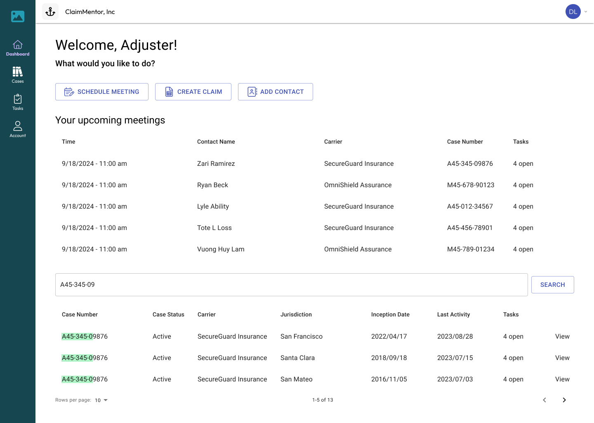

# ClaimMentor Dashboard

**Date**: August 24, 2024 → January 1, 2025

**My Role**: Product Designer, User Researcher

**Tools**: Figma, Slack, Calendly, Qualtrics, Generative AI

## The story of ClaimMentor
I never thought I would be working on insurance, an area where I have absolutely no prior experience. But I was lucky enough to stumble upon this early-stage startup which I joined as a product design intern.

My supervisor Luis founded the startup with a vision to unify the claims process which is currently a pain point for the insurance industry. Insurance claimants and adjusters alike find themselves having to jump between many different platforms - waiting on hold for a call to be answered, reading out one's email address for the insurance agent to send over relevant documents, and remaining on standby for a cold call that could be easily missed without a reliable scheduling mechanism. This error-prone and time-consuming process continues to be the norm across the insurance world. 

With ClaimMentor, important actions would be contained in one platform made accessible to all users who can sign in with a phone or email. It would eliminate the confusion of jumping between platforms, losing valuable documents in email histories, and dealing with a variety of errors resulting from the inconsistent nature of organizing sensitive information via phone calls.

## Features

ClaimMentor would have the following features to address problems commonly found among the insurance world:
* **Dashboard** - the homepage where agents can select among common actions they would do in a regular day
    * **Schedule Meeting** - opens the scheduler where the agent can fill in the details for a new meeting and share it with others who can accept or propose a new time
    * **Create Claim** - the agent can open a new insurance claim, upload relevant documents, and connect it to relevant contacts and meetings
    * **Add Contact** - the agent can create a new profile with the contact info, associated claims, and meetings of a person they're working with

* **Document center** - crucial documents for insurance cases like photo evidence, signed agreements, and other information
* **AI summary and transcription** - each meeting will be summarized and transcribed by AI for accessibility purposes. This immediately generates a searchable file with key words from the call.

## Research
What would target users say about the features we had planned? Would their advice lead us to add features we had not envisioned, or take away features that didn't have the impact we intended? Here are some of the results. I joined the team halfway through the process and I continued to iterate on user feedback with our latest prototype.

We reached out to users over professional networks like LinkedIn and Slack after posting a sign-up form to participate in a usability study. I've selected some notable quotes from over 20 users we interviewed.

**Gloria** - 37, claims adjuster at an auto insurance company
> I love these features! Especially the AI transcription feature, it's so nice to have that instead of manually taking notes during a call. The meeting format is so nice as well, joining through a calendar invite in the same platform is so much better than having to call someone or email them a link to a zoom meeting. 

**Rick** - 68, life insurance manager, retired
> These features are nice but I got lost on the homepage while looking for a case. It would be nice to see the cases because I did not know how to find them. The icons on the left hand bar weren't so clear to me and I didn't know to click on them at first.

**Travis** - 31, home insurance agent, self-employed
> I travel a ton to do my own inspections in the field. Lots of times I walk around a property with my phone or my ipad to gather evidence and documentation for my clients. A mobile-friendly version of this app would be a great help, especially if I can get a spot to upload photos I took directly to my claiment's case file. The current document center is already great, keep it up!

## Selected Screens
At the end of my internship, the screens looked like this:

**Dashboard/homepage**

We followed Rick's feedback about the cases themselves being difficult to find. We originally just had the three options: schedule, create, and add as larger icons on the landing page, and the cases were under the icon on the left hand sidebar. While we did not remove any of the side navigation options, we did leverage some of that empty space in the landing screen to add the meetings and cases with a search bar for adjusters to quickly access.

**Case Overview**

This screen has everything there is to know about any insurance claim. All relevant meetings, contacts, and documents can be found here. A claims agent like Travis would be able to upload his proof of loss photos directly to the case.

**Contact Profile**

Insurance claimants and all other relevant people will have a contact page with their details and cases they are connected to. Lisa is a witness, but she is relevant to Zari's workplace injury claim. While creating this profile, the claims adjuster noticed that Lisa has been a contact in a previous, unrelated auto insurance claim.

**Meeting**

An upcoming meeting will look like this. The adjuster will have the option to join, cancel, or reschedule the meeting. They can also contribute notes ahead of time.

**Confirmation modal - cancellation**

A modal will pop up, asking the adjuster to confirm that they really want to cancel the meeting. This is important for error prevention in the event of a misclick.

**AI Transcription**

Every meeting will have an auto-generated transcription from the AI. This creates a searchable transcription that can be copied or downloaded, which saves time for claims adjusters and prevents mistakes in the handling of cases.

## Takeaways

This internship was the perfect experience for me to design along the principle of "The user is not like me". I previously envisioned personal projects along the needs I would experience in my life, as a transit user, a gamer, and a musician. But the insurance world is a place I was completely unfamiliar with. I got the opportunity to serve users who have a set of needs I don't understand, through interviewing them and taking notes that would leverage my research and design skills regardless of our different experiences.

I concluded the internship with the project in the state that you see here, so any further changes have been handed off to whoever comes after me. Next steps in this project include
* Responsive design for mobile and tablet users
* Even more accessibility features like read-aloud
* The capability to take photos or videos directly in the app
* The **Tasks** feature which would let adjusters create a to-do list